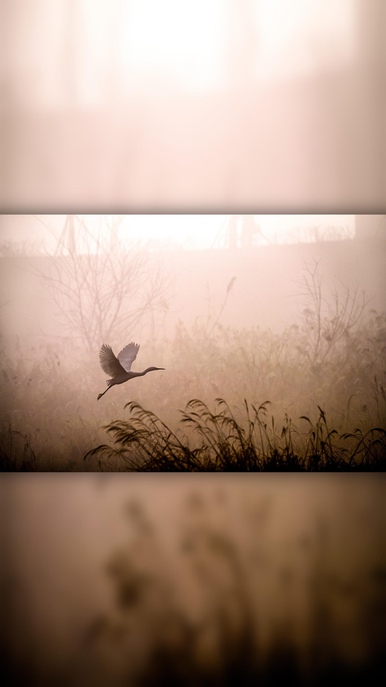

# wallpaper-maker

Wallpaper-maker converts an image to any aspect ratio like the following:




## Usage

### Dependencies

* Numpy
* ImageIO
* Python OpenCV 2

They can be installed as follow:

```bash
pip install numpy imageio opencv-python
```

A virtual environment is however recommended:

```bash
virtualenv venv
source venv/bin/activate
pip install numpy imageio opencv-python
```

Then to exit the virtualenvironment:

```bash
deactivate
```


### How to use

The easiest way for now is to use the `main.py` file and modifying the main parameters defined at the beginning of the file:

* `file_path`: the input image's path
* `output_path`: where to export the final image
* `to_ratio` (optional, default=16/9): the desired aspect ratio. If `to_ratio >= 1` the output image will be horizontal and the original image's height is preserved. If `to_ratio < 1` the output image will be vertical and the original image's width is preserved. Must be positive.
* `blur` (optional, default=0): how blurred the background will be. Must be positive.
* `shadow_blur` (optional, default=0): how blurred the shadow will be. Must be positive.
* `shadow_opacity` (optional, default=1.0): the shadow's opacity. Must be between 0 and 1.

To include the transformation into another project, the `transform` function from `transformer.py` can be used, giving it those parameters.


## Credits

The code has been writted by `lsonnino` and is free to use.

### Example images credits:

* test_1: https://pixabay.com/photos/egret-flying-fog-dawn-sunrise-5937499/

